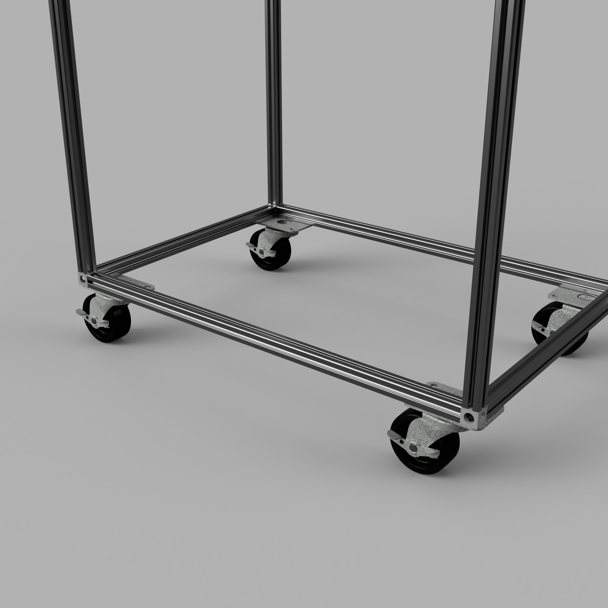
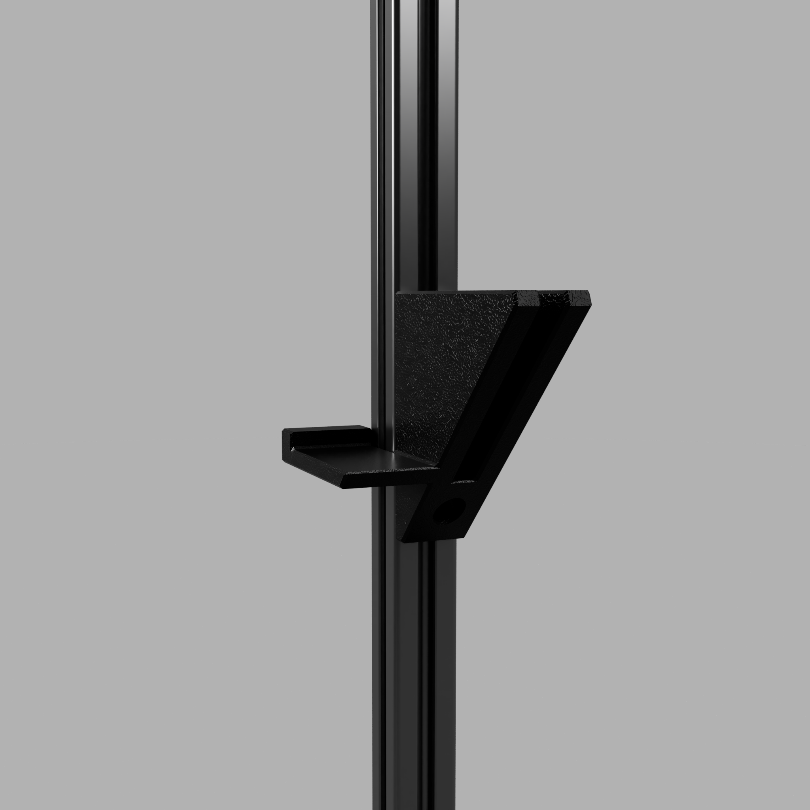
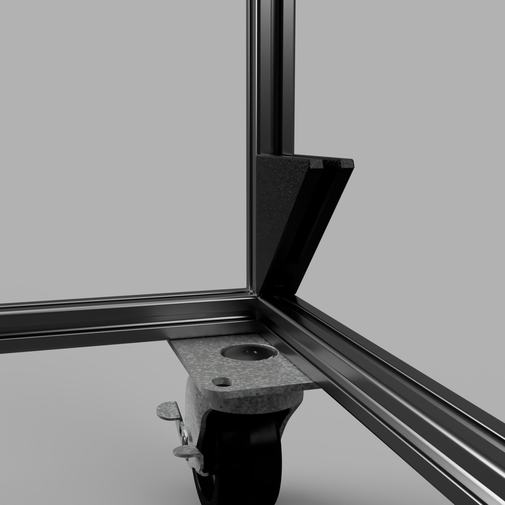
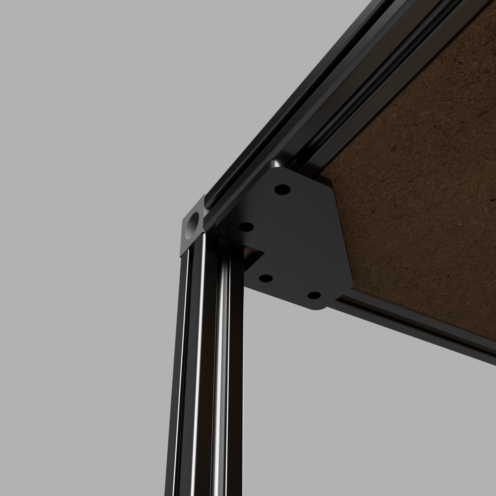
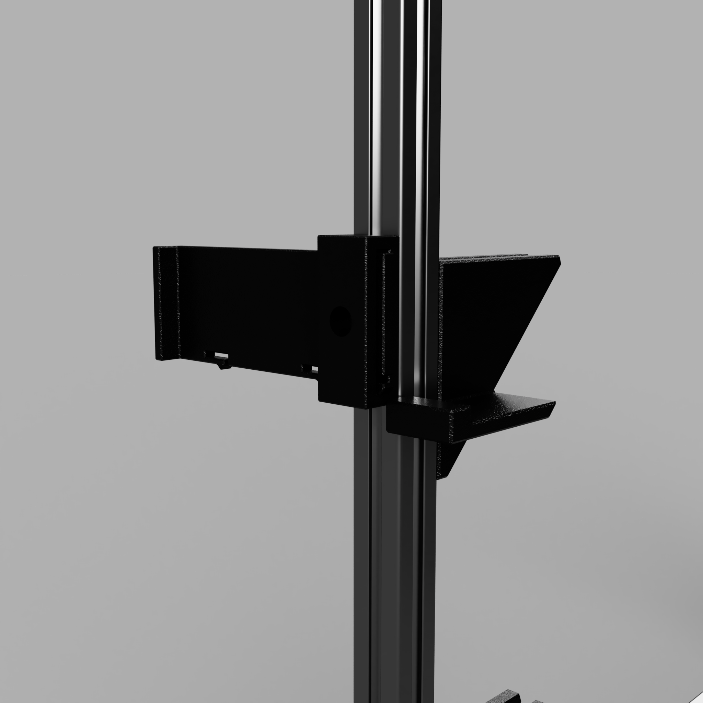

# Assembly Instructions

Refer to the [CAD](CAD) diagrams for detailed part orientation.

## Frame

- [Tap both ends of all extrusions with an M6 tap](https://the-playground.net/Fabrication+Techniques/Tapping+2020+Extrusions); all joints rely on threaded ends.
- Assemble the frame per CAD drawings:
  - Vertical members: 800 mm (PC-101)
  - Width: 400 mm (PC-102)
  - Depth: 600 mm (PC-103)
- Each corner joint uses a Corner Bracket (PC-104) and three M6 × 12 BHCS (PC-201).

## Casters

- Thread two M5 Drop Nuts (PC-207) partially through each caster corner. Secure using an M5 washer (PC-206) and M5 × 10 mm SHCS (PC-210).
- Remove a screw from an 800 mm vertical member at the corner. Replace it with an M6 × 30 mm screw (PC-202) and M6 washer (PC-203), securing the caster.
- Attach both the M5 drop nuts and M6 screw simultaneously to fasten the caster to the extrusion.
- Repeat for all four casters.

## Middle Shelves

### Brackets (middle)

Attach the shelf brackets (PC-001/PC-002) to the vertical extrusions, spacing them so the top of each shelf is 200 mm above the one below.

You may use the printed Shelf Bracket Spacer (PC-005) to make installation easier.  Place the spacer on the front of an extrusion resting on top of the plywood of the shelf below.  Install the next shelf bracket by resting it on top of the spacer.

### Plywood (middle)

Drop the shelves (PC-106) onto the brackets. Shelves fit loosely to allow for reconfiguration should you need to transport taller items.

## Side Supports

### Brackets (side)

At the bottom of the cart, install the four side supports (PC-003) flush with the bottom frame.  Install using M5 x 14mm SHCS (PC-205)and 2020 drop nuts (PC-207).

### Plywood (side)

Slide the thin strips of birch plywood (PC-107) into the brackets.  The side supports fit loosely to allow removal if you need to load or unload the cart from the side.

## Top/Bottom Shelves

### Brackets (top)

- Attach the four 2020 Corner Shelf Supports (PC-109) below the top frame using M5 Drop Nuts (PC-207) and M5 x 8mm SHCS (PC-204).

### Plywood (top/bottom)

- Drop the top shelf (PC-108) into the top frome so that it rests on the 2020 Corner Shelf Supports.
- Drop the bottom shelf (PC-108) into the bottom frame so that it rests on the casters.
- Shelves fit loosely to allow for reconfiguration should you need to transport taller items.

## Latches (Optional)

Attach latches (PC-004) to both sides front and back just above shelves.  Use M4 x 10mm FHCS (PC-208) and M4 drop nuts (PC209).  Remove the latch insert from the latch housing before attempting to insert FHCS.

