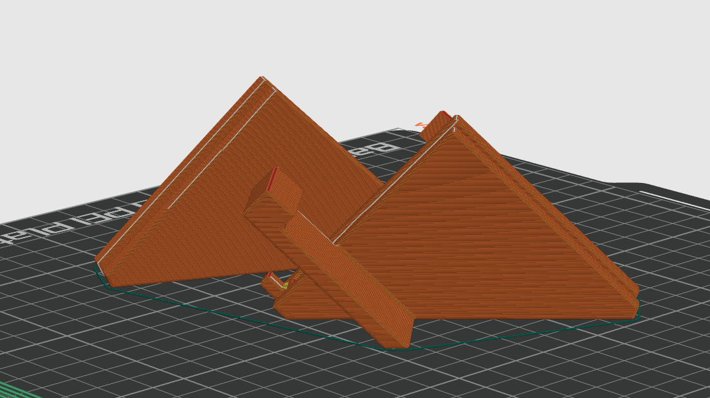
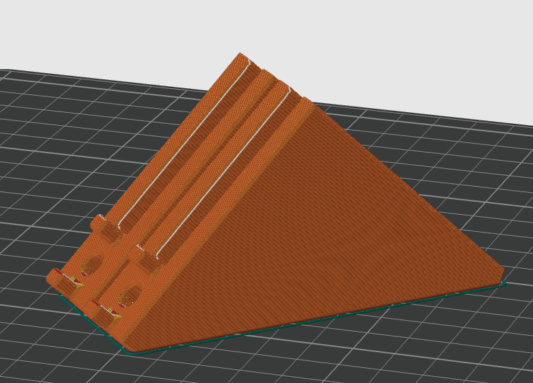
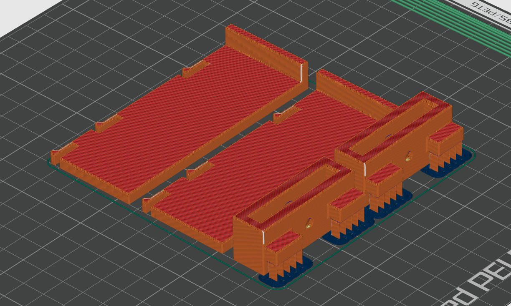

# Part Orientation

These parts have been successfully printed using [Voron Print Settings](https://docs.vorondesign.com/sourcing.html) in ASA.

Orient with the long diagonal side on the print bed to resist layer line separation under load.

## PC-001/PC-002 Shelf Bracket

- 12 × 2020 Shelf Bracket ([STEP](STEP)/[STL](STL))
  - Mirror 6 of them.  Left are different from right.

## PC-003 Side Bracket

- 4 × 2020 Side Bracket ([STEP](STEP)/[STL](STL))

## PC-004 Latch

- 16 x 2020 Latch ([STEP](STEP)) Optional, but suggested.
  - Must split the STEP file into separate objects to print.
  - Supports are integrated into the model and must be removed before installation

## PC-005 Shelf Bracket Spacer

- 1 x Shelf Bracket Spacer([STEP](STEP)/[STL](STL)). Optional, but suggested.
