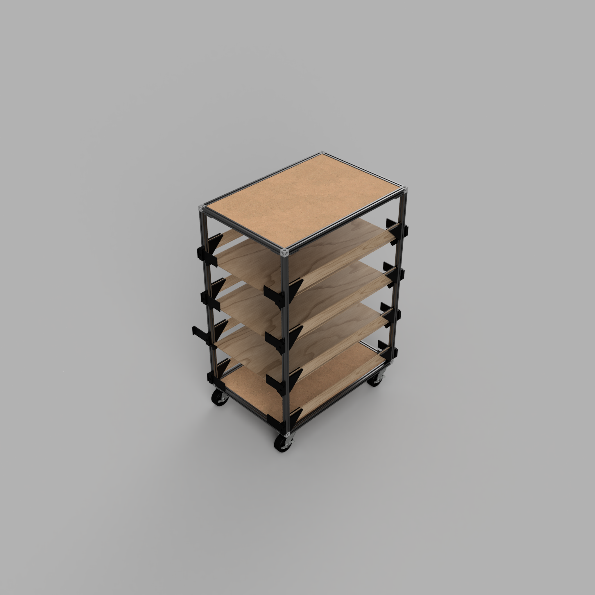
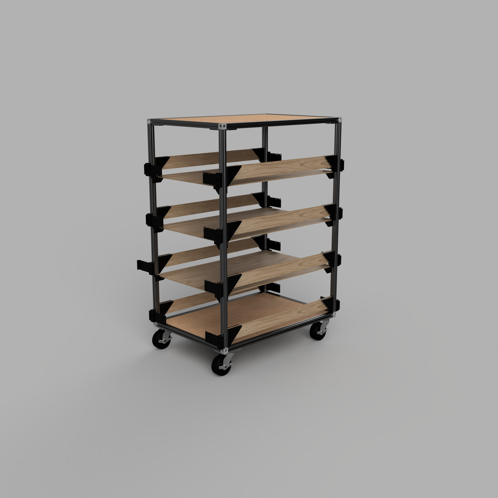
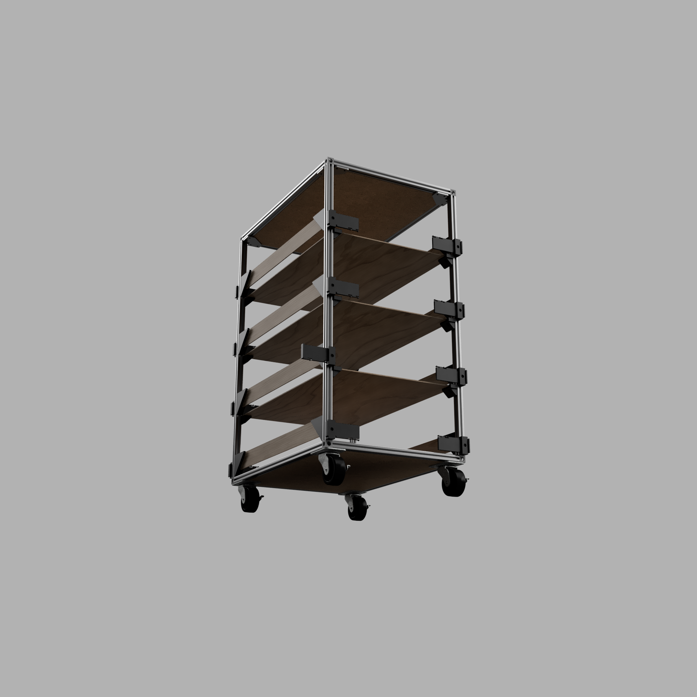
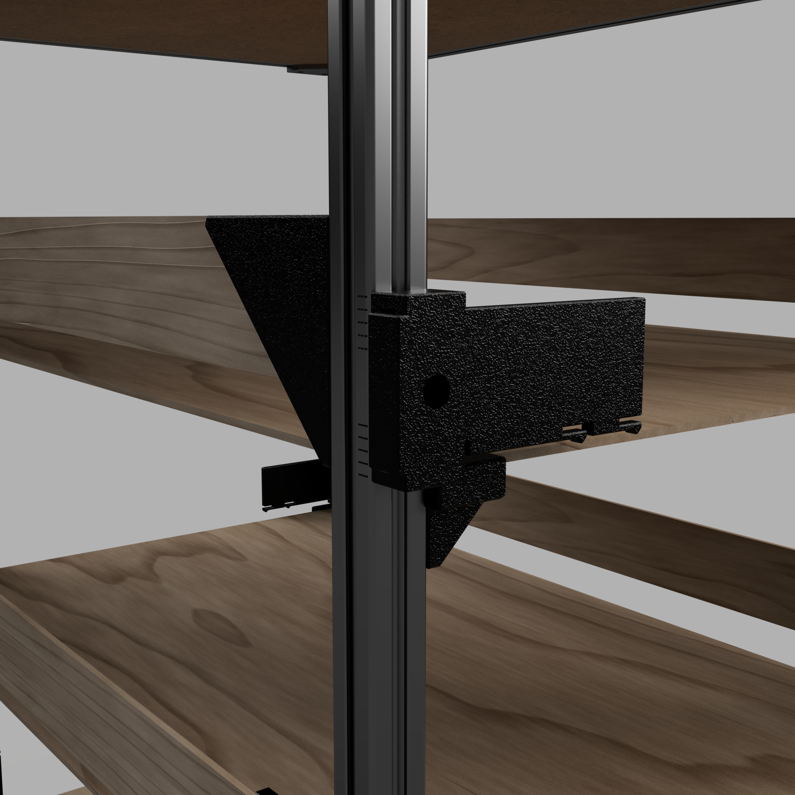
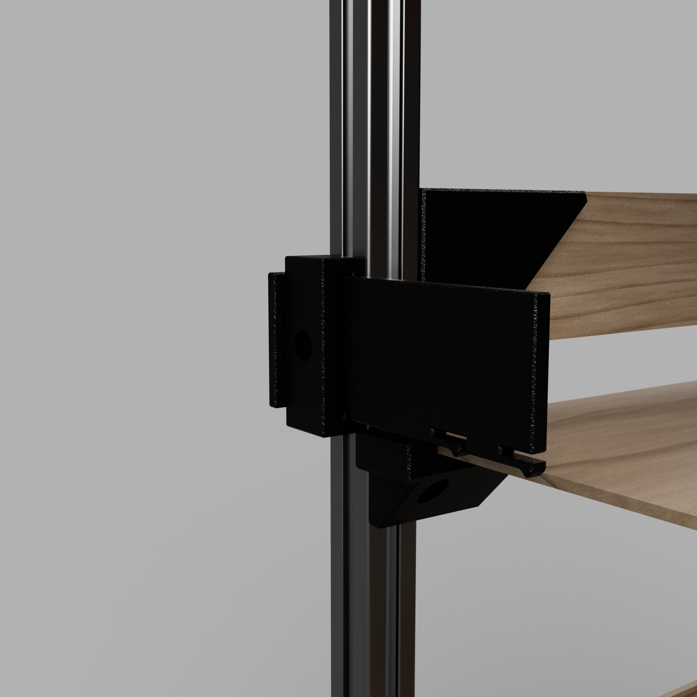

# Project Cart

The Project Cart is designed to hold [Euro Containers](https://en.wikipedia.org/wiki/Euro_container) (nominal size 400×300 mm or smaller) to organize project parts and tools.

# Summary

This cart provides a convenient storage solution for multiple projects at your workbench. To switch projects, simply return parts to their containers or place them on the cart, then roll it away. Roll in another cart to continue working seamlessly.

# Printing

## Print Settings

These parts have been successfully printed using [Voron Print Settings](https://docs.vorondesign.com/sourcing.html) in ASA.
- **Upper shelf parts:** Orient with the long diagonal side on the print bed to avoid layer line separation.
- **Lower shelf parts:** Place the large flat area on the print bed.
## Parts to Print
- 12 × 2020 Shelf Bracket ([STEP](STEP)/[STL](STL)) (Mirror 6 of them.  Left are different from right.)
- 4 × 2020 Front Bracket ([STEP](STEP)/[STL](STL))

# Assembly

## Bill of Materials

See the [Bill of Materials](BOM.md) for a complete list of required parts. Most components are listed from McMaster for convenience; feel free to substitute equivalent items from other suppliers.

## Assembly Instructions

Refer to the [CAD](CAD) diagram for detailed part orientation.

### Frame

- Tap both ends of all extrusions with an M6 tap; all joints rely on threaded ends.
- Assemble the frame per CAD drawings:
  - Vertical members: 800 mm
  - Width: 500 mm
  - Depth: 600 mm
- Each corner joint uses a Corner Bracket and three M6 × 12 BHCS.

### Casters

- Thread two M5 Drop Nuts partially through each caster corner. Secure using an M5 washer and M5 × 10 mm SHCS.
- Remove a screw from an 800 mm vertical member at the corner. Replace it with an M6 × 25 mm screw and M6 washer, securing the caster.
- Attach both the M5 drop nuts and M6 screw simultaneously to fasten the caster to the extrusion.
- Repeat for all four casters.

### Front Shelf Bracket

Install the front shelf brackets on the bottom two extrusions with shelf support screws and M5 drop nuts.

### Shelf Brackets

Attach the shelf brackets to the vertical extrusions, spacing them so the top of each shelf is 200 mm above the one below.

### Top Shelf

- Secure the top shelf brackets to the top frame rails, near the center, using M5 × 12 mm screws and M5 drop nuts.
- Turn the frame upside down and position it on the top shelf, leaving a 35 mm overhang on all sides.
- Mark the bracket locations. Drill pilot holes in the MDF top.
- Re-position the frame and secure it to the shelf with #6 x 3/4" wood screws.

### Shelves

Drop the shelves onto the brackets. Shelves fit loosely to allow for reconfiguration should you need to transport taller items.

# Acknowledgements

- [Corner Cube](https://grabcad.com/library/corner-cube-vslot-2020-3-ways-1) model by [Steepy](https://grabcad.com/steepy-1)
- [Caster](https://www.mcmaster.com/2358t26/) model by McMaster
- [Extrusion](https://www.mcmaster.com/5537T9) model by McMaster
- [Corner Bracket](https://www.mcmaster.com/5537T231/) model by McMaster

# ChangeLog

# Images

# License

Unless otherwise noted:
- **All written content and images:** © Charles Wimmer, licensed under [Creative Commons Attribution 4.0 International](https://creativecommons.org/licenses/by/4.0/).
- **All hardware design files (e.g., STL, CAD, PCB):** Licensed under the [CERN Open Hardware License v2 – Strongly Reciprocal](https://ohwr.org/cern_ohl_s_v2.txt).
- **All code and scripts:** Licensed under the [MIT License](https://opensource.org/licenses/MIT).