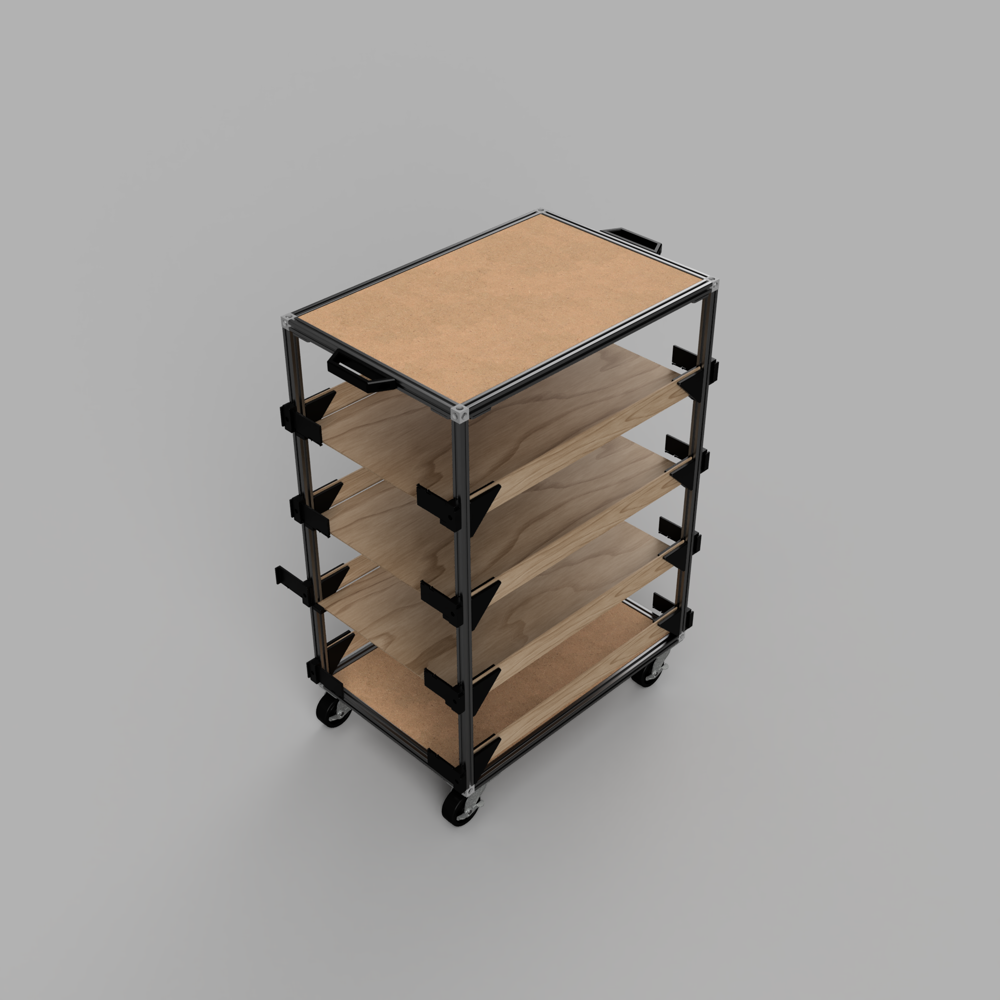
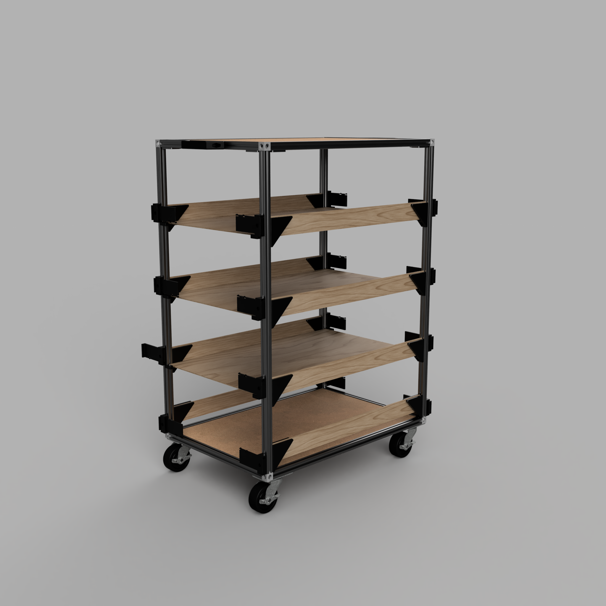
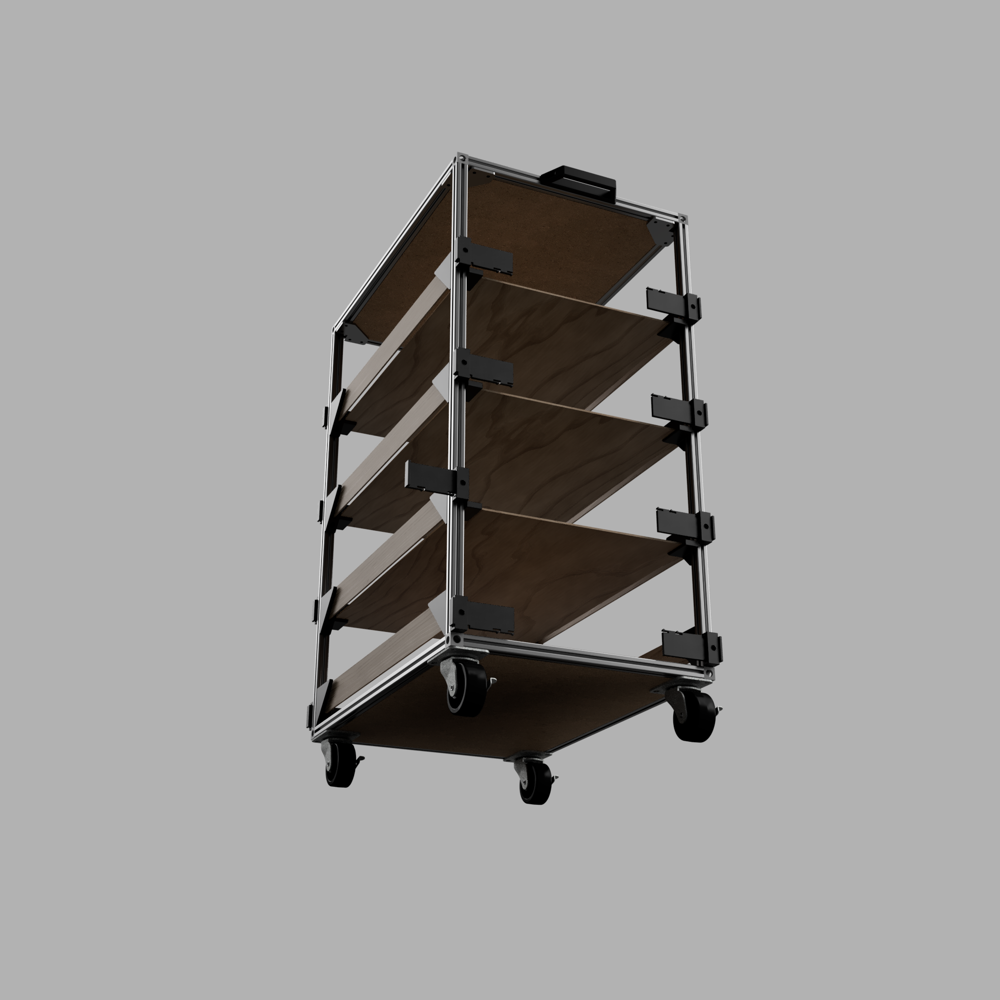
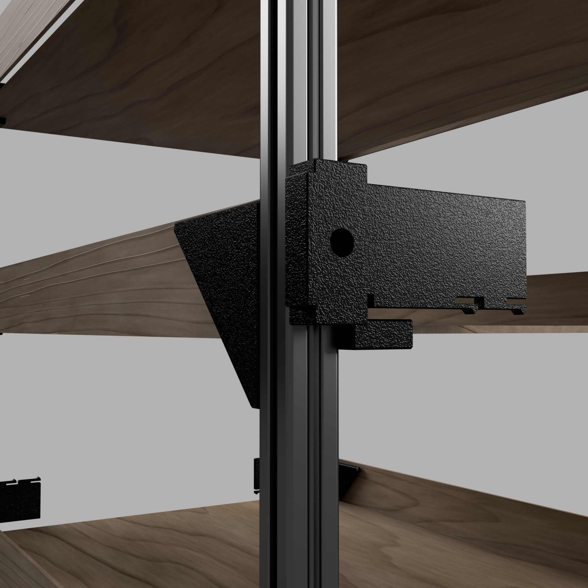
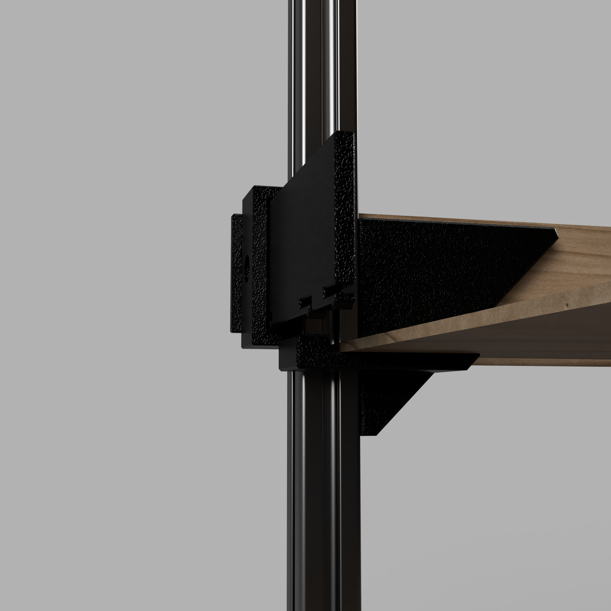
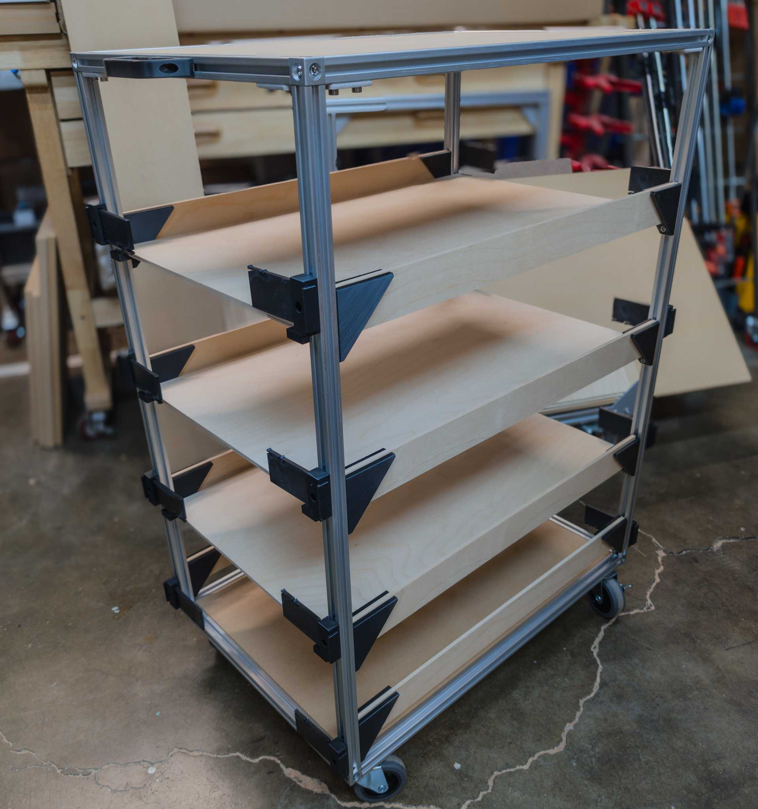
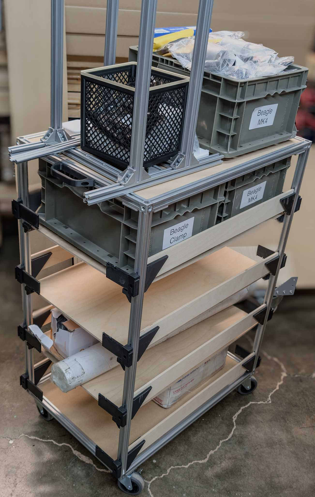

# Project Cart

The Project Cart is designed to hold [Euro Containers](https://en.wikipedia.org/wiki/Euro_container) (nominal size 400×300 mm or smaller) to organize project parts and tools. This cart provides a convenient storage solution for multiple projects at your workbench. To switch projects, simply return parts to their containers or place them on the cart, then roll it away. Roll in another cart to continue working seamlessly.

Please use the [latest released version](https://github.com/cwimmer/project-cart/releases/latest).  The main branch might have partial changes committed.

## Capabilities required to build this project

- Metric hex wrenches
- Large square
- FDM 3D Printer
- Ability to cut sheet goods square to accurate dimensions
  - Table saw or track saw are easiest.  Other methods will work.
- Metric ruler (800mm or longer)

## Table of Contents

- [Readme](README.md) - This file
- [Bill of Materials](BOM.md) - Specifications of parts included in this assembly
- [Assembly Instructions](ASSEMBLY.md) - Assembly Instructions
- [Changelog](CHANGELOG.md) - Chronologically ordered list of notable changes for each version of a project
- [Material Defaults](MATERIAL_DEFAULTS.md) - Descriptions of materials where not otherwise specified.
- [Part Orientation](PART_ORIENTATION.md) - Orientation instructions for 3D printing
- [On Suppliers](ON_SUPPLIERS.md) - Discussion of how to source parts for this assembly
- [Acknowledgements](ACKNOWLEDGEMENTS.md) - Acknowledgements of other authors included either for reference or inspiration

## General Notes

1. Unless otherwise specified, dimensions are in millimeters.
2. The CAD diagrams in the CAD directory are the authoritative definition of this assembly.

## License

Unless otherwise noted:

- **All written content and images:** © Charles Wimmer, licensed under [Creative Commons Attribution 4.0 International](https://creativecommons.org/licenses/by/4.0/).
- **All hardware design files (e.g., STL, CAD, PCB):** Licensed under the [CERN Open Hardware License v2 – Strongly Reciprocal](https://ohwr.org/cern_ohl_s_v2.txt).
- **All code and scripts:** Licensed under the [MIT License](https://opensource.org/licenses/MIT).

## Images

