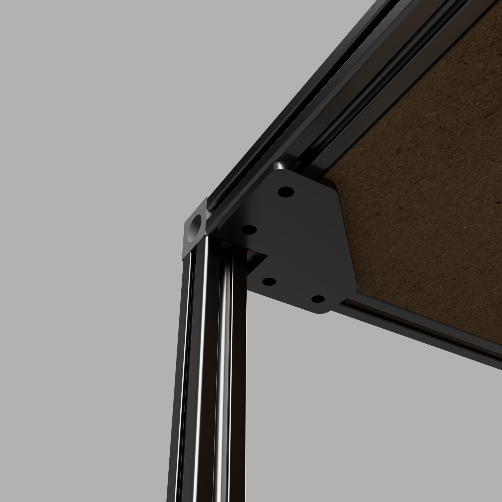

# Project Cart

The Project Cart is designed to hold [Euro Containers](https://en.wikipedia.org/wiki/Euro_container) (nominal size 400×300 mm or smaller) to organize project parts and tools.

Please use the [latest released version](https://github.com/cwimmer/project-cart/tree/v3) on the right.  The main branch might have partial changes committed. 

[comment]: #TODO: (Always update the release tag here when doing a release.)

# Summary

This cart provides a convenient storage solution for multiple projects at your workbench. To switch projects, simply return parts to their containers or place them on the cart, then roll it away. Roll in another cart to continue working seamlessly.

# Printing

## Print Settings

These parts have been successfully printed using [Voron Print Settings](https://docs.vorondesign.com/sourcing.html) in ASA.
- **Shelf parts:** Orient with the long diagonal side on the print bed to avoid layer line separation.
## Parts to Print
- 12 × 2020 Shelf Bracket ([STEP](STEP)/[STL](STL))
  - Mirror 6 of them.  Left are different from right.
- 16 × 2020 Side Bracket ([STEP](STEP)/[STL](STL))
- 16 x 2020 Latch ([STEP](STEP))
  - Must split the STEP file into object to print
  - Supports are integrated into the model and must be removed before installation

# Assembly

## Bill of Materials

See the [Bill of Materials](BOM.md) for a complete list of required parts. Most components are listed from McMaster for convenience; feel free to substitute equivalent items from other suppliers.

The [2020 Corner Shelf Supports](https://github.com/cwimmer/2020-corner-shelf-support) are a part I designed.  You can produce your own or [contact me](https://the-playground.net/Whoami) if you would to purchase some.

## Assembly Instructions

Refer to the [CAD](CAD) diagram for detailed part orientation.

### Frame

- Tap both ends of all extrusions with an M6 tap; all joints rely on threaded ends.
- Assemble the frame per CAD drawings:
  - Vertical members: 800 mm
  - Width: 400 mm
  - Depth: 600 mm
- Each corner joint uses a Corner Bracket and three M6 × 12 BHCS.

### Casters

- Thread two M5 Drop Nuts partially through each caster corner. Secure using an M5 washer and M5 × 8 mm SHCS.
- Remove a screw from an 800 mm vertical member at the corner. Replace it with an M6 × 25 mm screw and M6 washer, securing the caster.
- Attach both the M5 drop nuts and M6 screw simultaneously to fasten the caster to the extrusion.
- Repeat for all four casters.

### Middle Shelves

#### Brackets

Attach the shelf brackets to the vertical extrusions, spacing them so the top of each shelf is 200 mm above the one below.

#### Plywood

Drop the shelves onto the brackets. Shelves fit loosely to allow for reconfiguration should you need to transport taller items.

### Side Supports

#### Brackets

Attach the side brackets to the vertical extrusions, spacing them so they are 200 mm above the one below.

#### Plywood

Slide the thin strips of birch plywood into the side brackets.  The side supports fit loosely to allow removal if you need to load or unload the cart from the side.

### Top/Bottom Shelves

#### Brackets

- Attach the four 2020 Corner Shelf Supports below the top frame using M5 Drop Nuts and M5 x 12mm SHCS.

#### Plywood
- Drop the top shelf into the top frome so that it rests on the 2020 Corner Shelf Supports.
- Drop the bottom shelf into the bottom frame so that it rests on the casters.

### Latches
Attach latches to both sides front and back just above shelves.

# Acknowledgements

- [Corner Cube](https://grabcad.com/library/corner-cube-vslot-2020-3-ways-1) model by [Steepy](https://grabcad.com/steepy-1)
- [Caster](https://www.mcmaster.com/2358t26/) model by McMaster
- [Extrusion](https://www.mcmaster.com/5537T9) model by McMaster

# ChangeLog
## v3
- Added latch to secure containers in front and rear.
  - Latches are removable
  - Slide open and closed
  - Held in place by compliant mechanism
## v2
- Width changed from 610mm to 440mm
- Top changed from 35mm overhangs to inset in frame
- Bottom changed from 3mm birch plywood to 18mm MDF inset in frame
- Side supports added
## v1
Initial revision

# Images

# License

Unless otherwise noted:
- **All written content and images:** © Charles Wimmer, licensed under [Creative Commons Attribution 4.0 International](https://creativecommons.org/licenses/by/4.0/).
- **All hardware design files (e.g., STL, CAD, PCB):** Licensed under the [CERN Open Hardware License v2 – Strongly Reciprocal](https://ohwr.org/cern_ohl_s_v2.txt).
- **All code and scripts:** Licensed under the [MIT License](https://opensource.org/licenses/MIT).